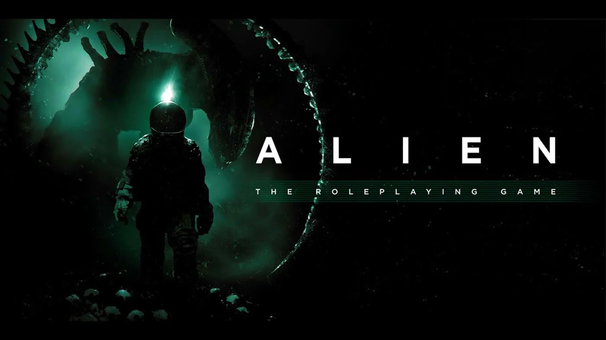

# Weyland-Yutani Ship Terminal



A FoundryVTT module that turns a second screen, tablet, or touch monitor into a fully interactive shipboard computer terminal for the Alien RPG. Built for in-person games where you want to put a real Weyland-Yutani interface in front of your players and let them interact with the ship directly. Green phosphor CRT display, scanlines, flicker, the works.

This was built for running Chariot of the Gods but the architecture supports other Alien RPG scenarios through a plugin system.

https://github.com/user-attachments/assets/GM-Terminal-Demo.mp4

<video controls src="GM-Terminal-Demo.mp4" title="Terminal Demo"></video>

---

## What It Does

The GM runs FoundryVTT normally on their screen. Players get a dedicated terminal display that takes over their entire browser window. Everything syncs in real time over sockets.

**Player Terminal buttons:**

- **STATUS** -- Ship overview showing vessel info, hull integrity, and all system states at a glance.
- **CREW** -- Crew manifest pulled live from FoundryVTT Actor sheets with health, stress, attributes, skills, and conditions.
- **SYSTEMS** -- Detailed diagnostics for each ship system with power levels and status indicators.
- **LOGS** -- Ship log entries that the GM can drip-feed during play, gated by clearance level.
- **MAPS** -- Static reference maps with pinch-zoom and pan support for touch screens.
- **NAV** -- Navigation and stellar cartography display.
- **WEAPONS** -- Tactical weapons panel (Cronus only).
- **SCIENCE** -- Science and research systems (Cronus only).
- **MU/TH/UR** -- AI chat interface where players can ask the ship's computer questions and get in-character responses.
- **COMMS** -- Communications array frequency and status display.
- **CARGO** -- Full cargo manifest of everything aboard the ship.
- **SCHEMATICS** -- Renders FoundryVTT scenes as deck schematics with tokens, pinch-zoom, and pan.
- **CMD CODE** -- Numeric keypad for entering command codes that unlock higher clearance levels.

**GM-only buttons:**

- **GAME CLOCK** -- In-game time tracker that broadcasts to all player terminals.
- **EMERGENCY** -- Triggers emergency protocols (self-destruct, evacuation, lockdown, distress, atmosphere purge) with alarms and voice warnings on player terminals.
- **GM CONTROLS** -- Module settings, ship profile switching, and terminal configuration.

---

## Installation

### Manifest URL (Recommended)

1. In FoundryVTT, go to **Add-on Modules** and click **Install Module**.
2. Paste this URL into the **Manifest URL** field at the bottom:

```
https://raw.githubusercontent.com/BenTheCloudGuy/foundryvtt-alienrpg-module/main/module.json
```

3. Click **Install**.
4. In your World, go to **Settings > Manage Modules** and enable **Weyland-Yutani Ship Terminal**.

### Manual Install

1. Download or clone this repository.
2. Copy the module folder into your FoundryVTT `Data/modules/` directory. The folder should be named `wy-terminal`.
3. Restart FoundryVTT.
4. Enable the module in **Settings > Manage Modules**.

### Requirements

- FoundryVTT v13 or later
- AlienRPG (Alien Evolved) game system v4.0.0 or later
- An OpenAI API key if you want the MU/TH/UR AI chat to work (optional, the terminal works fine without it)

---

## Setup for In-Person Play

The intended setup is two screens: one for the GM running FoundryVTT normally, and one facing the players showing the terminal.

1. Open FoundryVTT and log in as GM on your main screen.
2. Open a second browser window (or on a second device/tablet) and log in as a Player.
3. The Player client automatically goes full-screen terminal mode -- no Foundry UI visible, just the green-screen interface.
4. The GM gets a movable pop-out terminal window that can be minimized, resized, and dragged around so you can still access FoundryVTT underneath.

### MU/TH/UR AI Setup

1. Open the terminal and click **GM CONTROLS**.
2. Enter your OpenAI API key.
3. Select a scenario plugin (montero, cronus, etc.).
4. Players can now ask the ship's computer questions through the MU/TH/UR button and get scenario-aware AI responses.

If you do not have an API key, MU/TH/UR falls back to GM Relay mode where player questions pop up on the GM screen and the GM types responses manually.

---

## GM Commands

These can be run from the browser console or Foundry macros:

```javascript
// Open/close/toggle the terminal
game.wyTerminal.open();
game.wyTerminal.close();
game.wyTerminal.toggle();

// Broadcast an alert to all player terminals
game.wyTerminal.sendGmCommand({ type: 'broadcast', message: 'HULL BREACH DETECTED', sound: 'horn' });

// Inject a scripted MU/TH/UR response
game.wyTerminal.sendGmCommand({ type: 'inject_response', message: 'ACCESS DENIED.' });

// Toggle a story flag (rebuilds the AI system prompt)
game.wyTerminal.sendGmCommand({ type: 'update_flag', flag: 'docked_with_cronus' });

// Switch scenario plugin mid-game
game.wyTerminal.sendGmCommand({ type: 'switch_plugin', plugin: 'cronus_life_support' });
```

---

## Compatibility

- **FoundryVTT:** v13+
- **Game System:** AlienRPG (Alien Evolved) v4.0.0+
- **Browsers:** Chrome, Firefox, Edge, Safari (including mobile)
- **Touch Devices:** Full support for tablets and touch monitors

## To Do

- GM CONTROLS button to auto-configure FoundryVTT for the best experience
- Custom wire art renderings of the ships to replace current maps (working on this with artists on Fiverr)
- Custom art for LOGS, such as scientific samples (working on this with artists on Fiverr)
- Custom log entries for Chariot of the Gods with video/gif animations
- Add support for audio playback logs
- Add support for speech-to-text so players can converse with MU/TH/UR via voice
- Create a custom agent for gameplay and use it for MU/TH/UR interactions, plus allow the GM to query the scenario and AlienRPG via Foundry chat -- should improve performance and reduce token costs

## License

This module is designed for personal use with the Alien RPG tabletop roleplaying game by Free League Publishing.
Alien RPG is (c) Free League Publishing. Weyland-Yutani is a fictional corporation from the Alien franchise.
