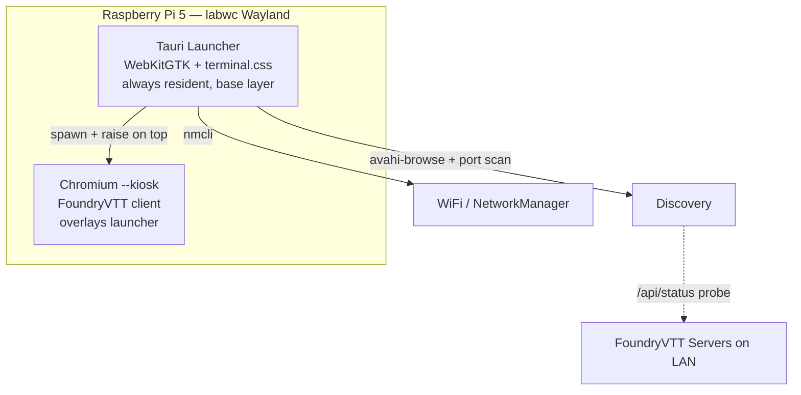
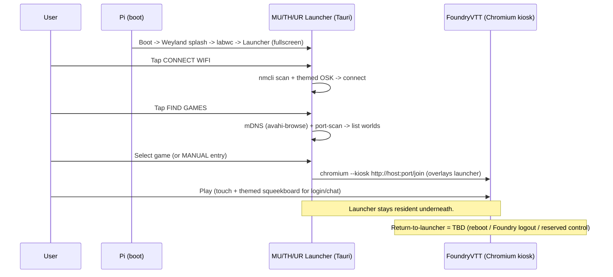

# AlienPi — Custom Raspberry Pi Image (MU/TH/UR Kiosk for FoundryVTT)

> **Status:** Planning. This document captures the locked architecture and open
> questions for a themed Raspberry Pi image that boots into a Weyland-Yutani /
> MU/TH/UR styled launcher, connects WiFi, discovers FoundryVTT games on the
> LAN, and launches them full-screen in a touch kiosk.

## Goal

A custom Pi image that:

1. Boots straight into a themed **MU/TH/UR launcher** (no visible Linux desktop).
2. Lets the user **connect to WiFi** using an on-screen keyboard.
3. **Discovers running FoundryVTT games** on the LAN (named list) OR accepts a
   manual IP/hostname + port.
4. Launches the selected game **full-screen, kiosk mode, full touch support**,
   as a Chromium session that **overlays** the always-resident launcher.
5. **Never exits to a Linux desktop** — the launcher is the permanent shell; the
   Foundry kiosk simply covers it. (See *Return-to-launcher* below.)
6. Ships as a **flashable `.img` published alongside the `wy-terminal` module**.
7. Plays **MU/TH/UR boot + response sound effects** throughout the theme.

## Locked stack

| Layer | Choice | Notes |
|-------|--------|-------|
| Hardware | **Raspberry Pi 5**, 1080p display | Active cooling required; touch panel varies by user (generic capacitive multi-touch via libinput). |
| OS | **Raspberry Pi OS Lite 64-bit (Trixie)** | No desktop environment. |
| Compositor | **`labwc`** (Wayland) | Boots into launcher; single-compositor, swap apps model. |
| Launcher / Theme | **Tauri v2** (Rust backend + WebKitGTK webview) | Reuses `styles/terminal.css`, ASCII logos, boot screens, `terminal-sounds.mjs`. |
| Game client | **Chromium `--kiosk`** spawned by launcher | NOT the Tauri webview — Foundry canvas/WebGL best-tested on Chromium. |
| Discovery | **Avahi mDNS** (server-advertised) + **port-scan `/api/status`** fallback + **manual entry** | All paths confirm via `/api/status`. |
| WiFi | **`nmcli`** via Rust | Persists across reboots. |
| On-screen keyboard | Themed **in-launcher OSK** + **fully MU/TH/UR-themed `squeekboard`** for in-Foundry typing | Custom squeekboard layout + GTK CSS theme. |
| Audio | **MU/TH/UR boot + response SFX** from `muthur/sounds/` | Boot sequence, key-clicks, response beeps, printer/rattle accents. |
| Exit UX | **No OS exit.** Launcher is permanent; Foundry **overlays** it in kiosk | Kiosk lock; no drop to Linux desktop. |
| Build | **pi-gen custom stage** → flashable `.img` | Built on a **native arm64 GitHub runner** (`ubuntu-24.04-arm`). |

## Architecture



### Why Tauri for launcher, Chromium for game

- Tauri uses **WebKitGTK**, not Chromium. Great for the lightweight themed
  launcher (reuse existing CSS), but risky for Foundry's PixiJS/WebGL canvas.
- So: launcher = Tauri webview; game = Rust backend spawns **Chromium `--kiosk`
  --ozone-platform=wayland --touch-events=enabled**, raised **on top** of the
  always-running launcher. There is no path from the launcher to a Linux
  desktop — the launcher *is* the shell.

## Boot flow



## mDNS contract (server side)

Advertised by a small **host-networked sidecar** (`docker/mdns/`) alongside the
`benthebuilder/foundryvtt-alienrpg` container — **not** baked into the Foundry
image.

> **Why a sidecar?** mDNS multicast doesn't cross Docker's bridge network, so it
> needs `network_mode: host`. But the Foundry container requires a fixed
> `hostname:` for license binding, and host networking forbids both `hostname:`
> and `ports:`. A separate host-networked sidecar avoids the conflict: it polls
> the host-published `/api/status` and advertises on the LAN. Linux hosts only
> (no-op on Docker Desktop — the port-scan fallback covers that case).

- Sidecar runs `avahi-daemon` and writes `/etc/avahi/services/foundryvtt.service`
  (Avahi auto-reloads on change).
- **Service type:** `_foundryvtt._tcp` on the Foundry port (default `30000`).
- **TXT records:** `world`, `worldTitle`, `system`, `systemVersion`,
  `coreVersion`, `active`, `users` — derived from `/api/status` + the world
  title env.
- Enable with: `docker compose --profile mdns up --build`.
- Pi runs `avahi-browse -r _foundryvtt._tcp` → named list, e.g.
  *"MOTHER: Chariot of the Gods — 3 crew online"*.

### Port-scan fallback

- Async TCP connect sweep of local `/24` on port `30000`.
- `GET /api/status` on hits to confirm + pull the same fields.
- Manual entry uses the identical probe → typed-in hosts also show name/status.

## Theming & audio (MU/TH/UR)

The launcher reuses `styles/terminal.css`, the ASCII logos, and drives sound
from the existing `muthur/sounds/` assets to make the whole UX feel like a live
ship terminal.

Available SFX (in `muthur/sounds/`) and suggested use:

| Sound | Suggested trigger |
|-------|-------------------|
| `boot.wav` | Power-on / MU/TH/UR boot sequence |
| `screen_display.wav` | Screen/panel appears, view transitions |
| `beep.wav` | Button press / confirm |
| `buzz.wav` | Error / invalid action (bad WiFi password, failed connect) |
| `loud_type_start.wav`, `typing_long.wav`, `subtle_long_type.wav` | On-screen keyboard key-clicks & typed responses |
| `printer1.wav`, `printer2.wav` | "MU/TH/UR is responding" / list population |
| `rattle.wav`, `downshuffle.wav` | Discovery scan running, list refresh |
| `horn.wav` | Major alert / attention |

- **Boot sequence:** on labwc start, play `boot.wav` under an animated Weyland
  splash + boot log (reuse `templates/views/boot.hbs` styling) before revealing
  the launcher menu.
- **Responsiveness:** every tap/typed key emits a themed click; discovery and
  connect actions get printer/rattle "working" audio so waits feel diegetic.
- Audio bridged from the Tauri frontend (HTML5 audio) or a small Rust
  `play_sound` command; keep a single mixer so overlapping SFX don't clip.

## Return-to-launcher (decided: reboot-to-return)

The launcher can't be exited to the OS. To leave a game (wrong server, switch
tables, change WiFi) the terminal **reboots** — the most appliance-like, fully
locked option. There is no in-session disconnect control exposed to players.

- A themed **"RESTART TERMINAL"** action (and/or physical power-cycle) reboots
  the Pi; the Foundry session ends cleanly and the device boots back into the
  launcher (with the MU/TH/UR boot sequence + `boot.wav`).
- The restart action lives in the launcher chrome and/or a reserved corner;
  keep it deliberate (confirm prompt) so players don't reboot mid-combat.
- WiFi credentials persist across reboots (NetworkManager), so a reboot only
  costs the boot animation, not re-onboarding.

## Licensing posture

The Pi image is a **pure client** — launcher, theme, Chromium; **no FoundryVTT
binaries**. Foundry stays server-side (Docker image, licensed at runtime). The
shared `.img` has zero Foundry redistribution concern, matching the existing
`docker/README.md` posture.

## Proposed repo layout

```
pi-image/
  launcher/            # Tauri app
    src/               # Rust backend: wifi, discovery, launch, osk bridge
    ui/                # frontend — imports ../../styles/terminal.css
    tauri.conf.json
  pi-gen/              # custom pi-gen stage
    stage-alienpi/     # installs .deb, labwc, chromium, avahi, nm, squeekboard
  systemd/             # boot-to-launcher units
  docs/PLAN.md         # this file
docker/                # (existing) + add avahi advertiser
```

## Rust backend commands (planned surface)

- `wifi_scan()` → list `{ ssid, signal, security }` via `nmcli`.
- `wifi_connect(ssid, password)` → `nmcli dev wifi connect`.
- `discover_games()` → merge `avahi-browse` results + port-scan hits.
- `probe_status(host, port)` → `GET /api/status`, return world/system/users.
- `launch_game(host, port)` → spawn Chromium kiosk, raised over the launcher.
- `play_sound(name)` → play a MU/TH/UR SFX from `muthur/sounds/` (single mixer).
- `touch_test()` → first-boot multi-touch verification screen.

## First-boot / hardware notes

- Enable `vc4-kms-v3d` in `config.txt`; disable rainbow splash; custom Weyland
  boot logo.
- Touch panel varies → design for generic libinput multi-touch; include a
  **Touch Test** screen and a hidden "engineering" calibration menu as fallback.
- Active cooling mandatory for sustained Chromium load on Pi 5.

## Build pipeline

- Tauri **arm64** build on a **native arm64 GitHub-hosted runner**
  (`ubuntu-24.04-arm`) — no QEMU cross-compile. Produces the `.deb` directly.
- pi-gen custom stage installs the `.deb` + system packages, wires the systemd
  boot unit, applies `config.txt` tweaks and boot theming.

## Resolved decisions

1. **`/api/status` shape** — Not a blocker. We consume whatever the endpoint
   returns and surface the fields needed to connect; verified at build time.
2. **Exit UX** — **No exit from the launcher.** Foundry opens fullscreen/kiosk
   *over* the always-resident launcher. Return-to-launcher is **reboot-to-return**
   (themed "RESTART TERMINAL" or power-cycle); no in-session disconnect control.
3. **squeekboard theming** — **Fully themed** MU/TH/UR look (custom layout + GTK
   CSS). Go big.
4. **Tauri arm64 build** — **Native arm64 GitHub runner** (`ubuntu-24.04-arm`).
5. **Touch Test** — **Included in v1** (first-boot multi-touch verification).
6. **Audio** — MU/TH/UR boot + response SFX baked into the theme (see *Theming &
   audio*).

## Next steps (when leaving planning)

1. Prototype the Tauri build on `ubuntu-24.04-arm` (de-risk the pipeline).
2. Verify `/api/status` fields against the running Foundry.
3. Scaffold `pi-image/launcher` (Tauri) reusing `styles/terminal.css` + SFX.
4. Add the Avahi advertiser to the Docker image.
5. Author the pi-gen custom stage (labwc, kiosk lock, boot theming, audio).

